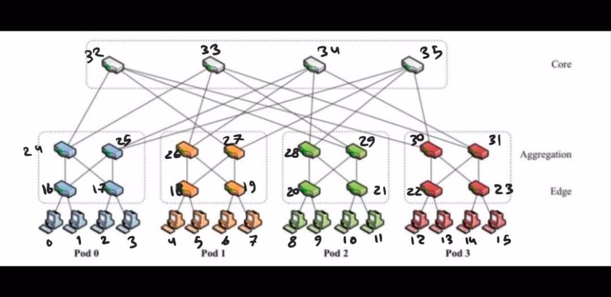
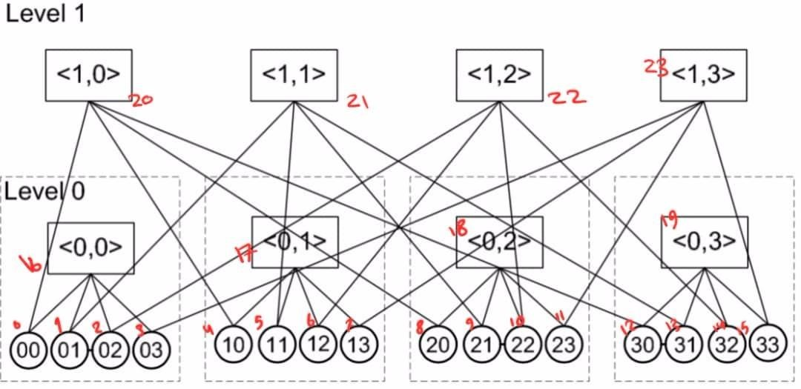

# Fat-Tree And BCube Topology Maker

This a virtual topology(Fat-Tree and BCube) maker in data centers.

## Give A Unique Number To Fat-Tree Elements



## Give A Unique Number To BCube Elements



## Introduction

We have some important topologies in datacenters such as Fat-Tree Bcube and Dcell. this app connects the servers(racks) to the switches and also switches to switches. We named the servers and swithces as the picture above. it entitled the the down-left most server to zero(0) and then go through to left step by step until reach the end of first level and give them ascending number. Then it goes to upper level and do this again. so every emelent(server and swithes) have a unique number. if there is a connection between two element it would print 1 and if there is no connection it would prints 99999. for example in fat-tree topology with (k = 4) the element with number 0 is connected to 16 so it print this:

```
	0   16  1
```

this code check every possible state so it writes the reverse of the above:

```
	16  0   1
```

A topology with N element will print out all N^2 states.

There is one input for Fat-Tree which is named K and it shows the number of each switch's ports.
For BCube we have two element which are K and n . K shows levels and n is the number of each switch's ports.

## How to run?

1. This code is written in Python 3.8.0 so you have to install Python 3.8.0 or above.

2. Download the project or clone it using git
   ```
   git clone https://github.com/HamedSanaei/CloudProject.git
   ```
3. Then go to the main folder of projet and run the code below on terinal or cmd:

   ```
    python main.py:
   ```

4. It print out the output in terminal and a file (Print.tx).

5. Enjoy!
